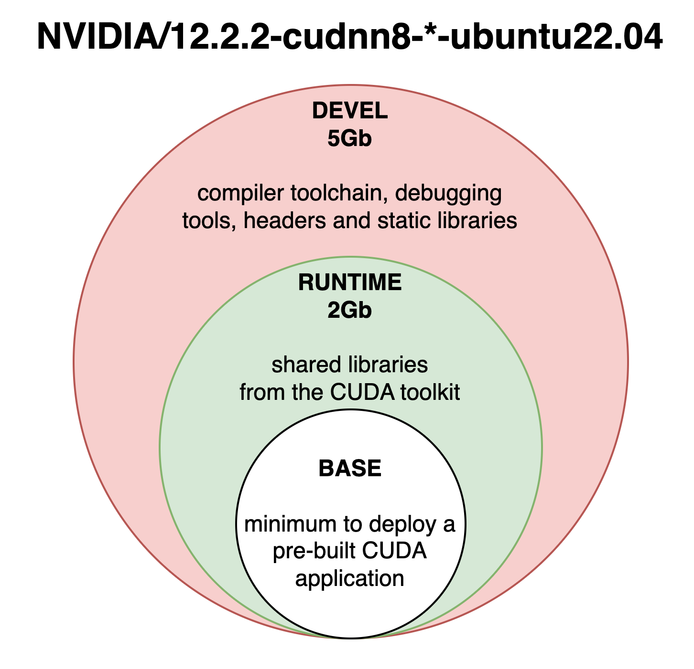
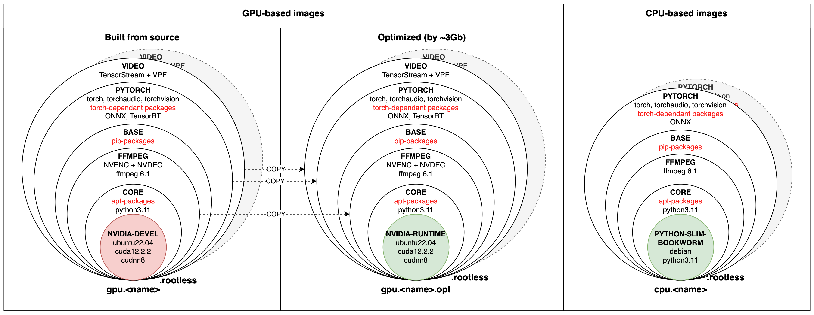
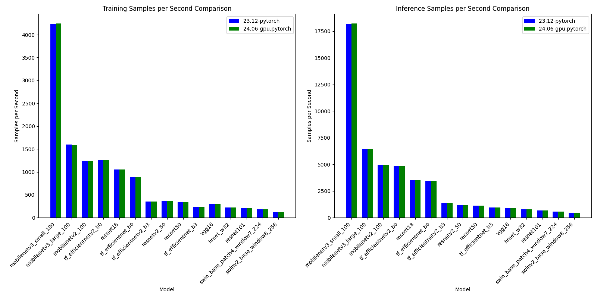

Collection of Docker images for ML/DL and video processing projects.

## Overview of `cpu.*` images

Several types of images are presented:

* `core`: Python (3.11.9)
* `ffmpeg`: FFmpeg (6.1)
* `base`: Python ML and CV packages listed [here](requirements/pip/base.txt)
* `pytorch`: PyTorch (2.1.2), torchvision (0.16.2), torchaudio (2.1.2) and torch based libraries listed [here](requirements/pip/pytorch.txt)

## Overview of `gpu.*` images

Several types of images are presented:

* `core`: CUDA (12.2.2), cuDNN (8.9.6), Python (3.11.9)
* `ffmpeg`: FFmpeg (6.1) with NVENC/NVDEC support
* `base`: Python ML and CV packages listed [here](requirements/pip/base.txt)
* `pytorch`: TensorRT (9.2.0), PyTorch (2.1.2), torchvision (0.16.2), torchaudio (2.1.2) and torch based libraries listed [here](requirements/pip/pytorch.txt)
* `video`: VideoProcessingFramework (2.0.0) and Tensor Stream (0.5.0) for full HW acceleration of video decoding

Supported NVIDIA architectures: Pascal (sm_60, sm_61), Volta (sm_70), Turing (sm_75), Ampere (sm_80, sm_86), Ada Lovelace (sm_89), Hopper (sm_90).  
You can identify the architecture of your GPU [here](https://arnon.dk/matching-sm-architectures-arch-and-gencode-for-various-nvidia-cards/).

## Overview of `gpu.*.opt` images

There are also optimized GPU images based on `nvidia-runtime` images, which have the same packages and libraries installed as stated above.
To install them add `.opt` suffix at the end of the docker image name, e.g. `dokai:gpu.pytorch.opt`.

<details><summary>Difference between `nvidia-devel` and `nvidia-runtime` images</summary>
<p>
Nvidia's CUDA images come in three flavors and are available through the NVIDIA public hub repository.

* **base**: starting from CUDA 9.0, contains the bare minimum (libcudart) to deploy a pre-built CUDA application. Use this image if you want to select which CUDA packages you want to install manually.
* **runtime**: extends the base image by adding all the shared libraries from the CUDA toolkit. Use this image if you have a pre-built application using multiple CUDA libraries.
* **devel**: extends the runtime image by adding the compiler toolchain, the debugging tools, the headers, and the static libraries. Use this image to compile a CUDA application from sources.



**Runtime** and **devel** are the ones that are mostly used and the differences between them are the image sizes (~3Gb), presence of compilers, and debugging tools.
</p>
</details>

## Overview of `*.rootless` images

Initially, all Dokai images were root-based, meaning that they had root privileges inside of the docker container.
According to the [Docker best-practices](https://docs.docker.com/build/building/best-practices/#user)
it is better to run docker containers without sudo rights with explicitly set user. Because of that 
`*.rootless` images were added to duplicate all existing images, but without sudo privileges.
The name of the user is set to `dokai` and it has `1000` set as UID/GID.

Sooner or later these images will fully replace root-based ones as they are more secure.

## Examples

Pull an image from the GitHub Container [registry](https://github.com/osai-ai/dokai/pkgs/container/dokai)
```bash
docker pull ghcr.io/osai-ai/dokai:24.06-gpu.pytorch
```

Docker Hub [mirror](https://hub.docker.com/r/osaiai/dokai/tags)
```bash
docker pull osaiai/dokai:24.06-gpu.pytorch
```

Check available GPUs inside the container
```bash
docker run --rm \
    --gpus=all \
    ghcr.io/osai-ai/dokai:24.06-gpu.pytorch \
    nvidia-smi
```

##### In case of `*.rootless` images there may permission problems happen within docker container:

- If the source code is copied to the container with the command `COPY`, make sure to change the owner
of the copied files and folders with additional flag, for example:

```bash
FROM dokai:gpu.video.opt.rootless

WORKDIR /home/$UNAME/workdir
COPY --chown=$UID:$GID ./ ./

...
```

- If the source code is mounted as a volume with the flag `-v` make sure to mount it to the correct 
user home directory path, and `--user` flag is passed, for example like this:

```bash
docker run --rm -it \
    --user=$(id -u):$(id -g) \
	-v $(shell pwd):/home/dokai/workdir \
	ghcr.io/osai-ai/dokai:24.06-gpu.pytorch.opt.rootless \
	bash
```

Or make sure that the mounted volume has enough permission for the `dokai:1000:1000` user to work.

The result of above commands strongly depends on the local setup, although it should work in most cases.

## Package versions



### CPU images

<details><summary>dokai:24.06-cpu.core</summary>
<p>

[ghcr.io/osai-ai/dokai:24.06-cpu.core](https://github.com/osai-ai/dokai/pkgs/container/dokai)

Image based on `python:3.11.9-slim-bookworm` which includes:

- Debian Bookworm Operational System;
- Python 3.11.9;
- etc..

On top of that packages are installed, here's a brief description and purpose of each:

**Utilities:**
- **nano, vim, tmux** are text editors and terminal multiplexers used for editing files and managing terminal sessions.
- **unzip** is a utility used to decompress ZIP archives, commonly used for extracting files from compressed archives.
- **git** is a distributed version control system used for tracking changes in source code during software development.
- **wget, curl** are command-line tools used for downloading files from the internet, commonly used in scripts and automation tasks.
- **htop** is interactive system monitoring tool used for displaying system resource usage.
- **sysstat** collects and reports system performance statistics, including CPU, memory, and disk usage.

</p>
</details>

<details><summary>dokai:24.06-cpu.ffmpeg</summary>
<p>

[ghcr.io/osai-ai/dokai:24.06-cpu.ffmpeg](https://github.com/osai-ai/dokai/pkgs/container/dokai)

Image based on `dokai:24.06-cpu.core`:

Additionally, installed:

- FFmpeg (n6.1)

</p>
</details>

<details><summary>dokai:24.06-cpu.base</summary>
<p>

[ghcr.io/osai-ai/dokai:24.06-cpu.base](https://github.com/osai-ai/dokai/pkgs/container/dokai)

Image based on `dokai:24.06-cpu.ffmpeg`:

Additionally, installed:

- Python ML and CV packages: [requirements.txt](requirements/pip/base.txt)

</p>
</details>

<details><summary>dokai:24.06-cpu.pytorch</summary>
<p>

[ghcr.io/osai-ai/dokai:24.06-cpu.pytorch](https://github.com/osai-ai/dokai/pkgs/container/dokai)

Image based on `dokai:24.06-cpu.base`:

Additionally, installed:

- Pytorch, torch-audio, torch-vision;
- Pytorch-related packages: [requirements.txt](requirements/pip/pytorch.txt)

</p>
</details>

### GPU images built from source

<details><summary>dokai:24.06-gpu.core</summary>
<p>

[ghcr.io/osai-ai/dokai:24.06-gpu.core](https://github.com/osai-ai/dokai/pkgs/container/dokai)

Image based on `nvidia/cuda:12.2.2-cudnn8-devel-ubuntu22.04` which includes:

- Ubuntu 22.04 Operational System;
- CUDA (12.2.2);
- cuDNN (8.9.6);
- NVCC;
- etc..

On top of that packages are installed, here's a brief description and purpose of each:

**Python (3.11.9):**
- **python3.11** is a programming language used for scripting and software development.
- **python3.11-dev** contains header files and development tools for building Python extensions.
- **python3.11-distutils** contains utilities for distributing and installing Python packages.
- **python3.11-tk** contains Tkinter, a GUI toolkit for Python.

**Builders, configurators and compilers:**
- **build-essential** package contains essential tools required for building software on Ubuntu, including compilers (gcc, g++, etc.) and build-related tools.
- **Yasm and nasm** are assemblers used for compiling assembly language code into machine-readable format, commonly used in building software.
- **Ninja** is a small build system that is fast and efficient, used as an alternative to GNU Make in some projects.
- **cmake** is a cross-platform build system generator used to control the software compilation process using simple platform-independent configuration files.
- **pkgconf** is a package configuration system used to help locate and configure libraries needed for building software.
- **gfortran** is a GNU Fortran compiler used for compiling Fortran code.
- **autoconf and libtool** are tools for generating configure scripts and managing software builds on various platforms.

**Utilities:**
- **nano, vim, tmux** are text editors and terminal multiplexers used for editing files and managing terminal sessions.
- **unzip** is a utility used to decompress ZIP archives, commonly used for extracting files from compressed archives.
- **git** is a distributed version control system used for tracking changes in source code during software development.
- **wget, curl** are command-line tools used for downloading files from the internet, commonly used in scripts and automation tasks.
- **htop and nvtop** are interactive system monitoring tools used for displaying system resource usage.
- **sysstat** collects and reports system performance statistics, including CPU, memory, and disk usage.

**Libraries:**
- **libsm6, libxext6, libxrender1, libgl1-mesa-glx** libraries for X Window System used for rendering graphics and managing graphical applications.
- **libtcmalloc-minimal4** is a memory allocation library, providing optimized memory management functions.
- **libx264-dev** is a library for encoding H.264 video streams.
- **libsndfile1** is a library for reading and writing audio files.
- **libssl-dev** is a development package for OpenSSL, providing cryptographic functions.
- **libpng-dev and libjpeg-dev** are development libraries for handling PNG and JPEG image formats, respectively.
- **libmp3lame-dev** is a development library for encoding and decoding MP3 audio files.
- **liblapack-dev** is a library for numerical linear algebra functions.
- **libopenblas-dev** is an optimized BLAS (Basic Linear Algebra Subprograms) library.

</p>
</details>

<details><summary>dokai:24.06-gpu.ffmpeg</summary>
<p>

[ghcr.io/osai-ai/dokai:24.06-gpu.ffmpeg](https://github.com/osai-ai/dokai/pkgs/container/dokai)

Image based on `dokai:24.06-gpu.core`:

Additionally, installed:

- FFmpeg (n6.1)
- nv-codec-headers (n12.1.14.0)

</p>
</details>

<details><summary>dokai:24.06-gpu.base</summary>
<p>

[ghcr.io/osai-ai/dokai:24.06-gpu.base](https://github.com/osai-ai/dokai/pkgs/container/dokai)

Image based on `dokai:24.06-gpu.ffmpeg`:

Additionally, installed:

- Python ML and CV packages: [requirements.txt](requirements/pip/base.txt)

</p>
</details>

<details><summary>dokai:24.06-gpu.pytorch</summary>
<p>

[ghcr.io/osai-ai/dokai:24.06-gpu.pytorch](https://github.com/osai-ai/dokai/pkgs/container/dokai)

Image based on `dokai:24.06-gpu.base`.

Additionally, installed:

- TensorRT (9.2.0)
- MAGMA (2.7.1)
- Pytorch, torch-audio, torch-vision;
- Pytorch-related packages: [requirements.txt](requirements/pip/pytorch.txt)

</p>
</details>

<details><summary>dokai:24.06-gpu.video</summary>
<p>

[ghcr.io/osai-ai/dokai:24.06-gpu.video](https://github.com/osai-ai/dokai/pkgs/container/dokai)

Image based on `dokai:24.06-gpu.pytorch`.

Additionally, installed:

- VideoProcessingFramework==2.0.0 (source, v2.0.0)  
- tensor-stream==0.5.0 (source, 0.5.0)

</p>
</details>

### GPU images optimized

Optimized set is composed of the previous one but based on lighter NVIDIA `runtime` base image.  

<details><summary>dokai:24.06-gpu.core.opt</summary>
<p>

[ghcr.io/osai-ai/dokai:24.06-gpu.core.opt](https://github.com/osai-ai/dokai/pkgs/container/dokai)

Image based on `nvidia/cuda:12.2.2-cudnn8-runtime-ubuntu22.04` and includes the same
additionally installed packages as `dokai:24.06-gpu.core`.

</p>
</details>


<details><summary>dokai:24.06-gpu.ffmpeg.opt</summary>
<p>

[ghcr.io/osai-ai/dokai:24.06-gpu.ffmpeg.opt](https://github.com/osai-ai/dokai/pkgs/container/dokai)

Image based on `dokai:24.06-gpu.core.opt` and includes the same
additionally installed packages as `dokai:24.06-gpu.ffmpeg`.

</p>
</details>


<details><summary>dokai:24.06-gpu.base.opt</summary>
<p>

[ghcr.io/osai-ai/dokai:24.06-gpu.base.opt](https://github.com/osai-ai/dokai/pkgs/container/dokai)

Image based on `dokai:24.06-gpu.ffmpeg.opt`  and includes the same
additionally installed packages as `dokai:24.06-gpu.base`.

</p>
</details>


<details><summary>dokai:24.06-gpu.pytorch.opt</summary>
<p>

[ghcr.io/osai-ai/dokai:24.06-gpu.pytorch.opt](https://github.com/osai-ai/dokai/pkgs/container/dokai)

Image based on `dokai:24.06-gpu.base.opt`  and includes the same
additionally installed packages as `dokai:24.06-gpu.pytorch`.

</p>
</details>


<details><summary>dokai:24.06-gpu.video.opt</summary>
<p>

[ghcr.io/osai-ai/dokai:24.06-gpu.video.opt](https://github.com/osai-ai/dokai/pkgs/container/dokai)

Image based on `dokai:24.06-gpu.pytorch.opt`  and includes the same
additionally installed packages as `dokai:24.06-gpu.video`.

</p>
</details>

### Performance comparison


<details><summary>`dokai:23.12-pytorch` vs `dokai:24.04-gpu.pytorch`</summary>
<p>



</p>
</details>

### Size comparison

| Image   | cpu.*\[.rootless\] | gpu.*\[.rootless\] | gpu.*.opt\[.rootless\] |
|---------|--------------------|--------------------|------------------------|
| core    | 0.49Gb             | 11Gb               | 4.5Gb                  |
| ffmpeg  | 0.74Gb             | 11Gb               | 4.6Gb                  |
| base    | 2.0Gb              | 12Gb               | 5.6Gb                  |
| pytorch | -                  | 17Gb               | 12Gb                   |
| video   | -                  | 17Gb               | 12Gb                   |

Versions for past releases can be found in [release descriptions](https://github.com/osai-ai/dokai/releases).
